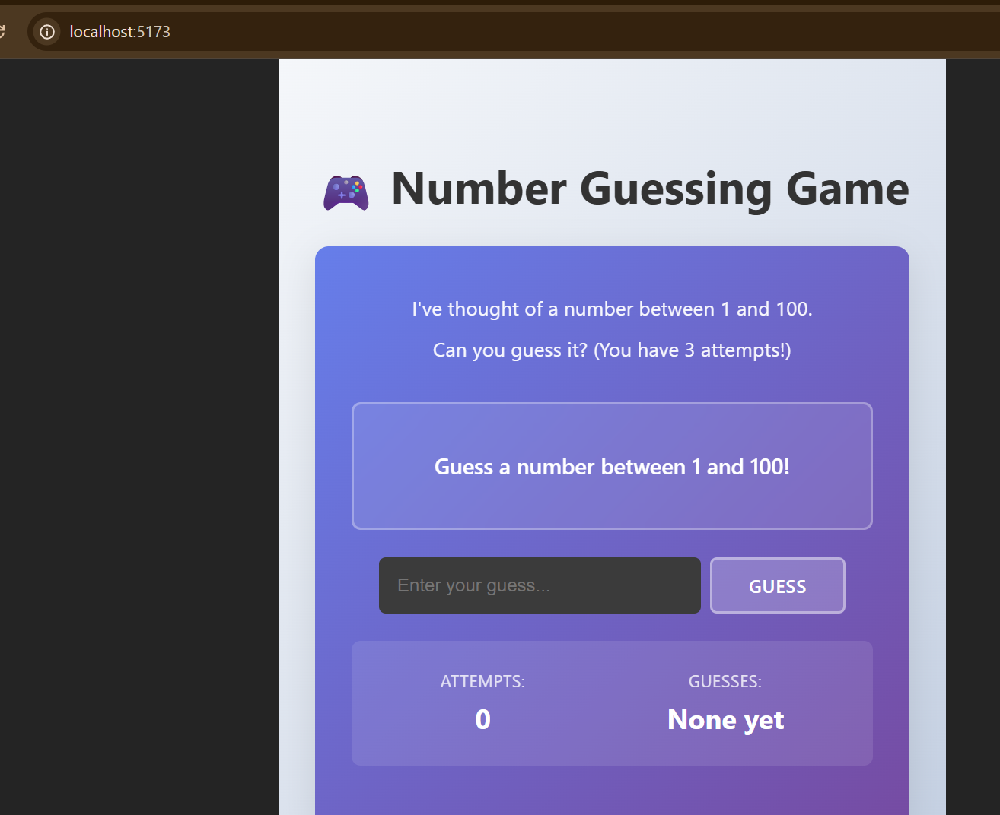
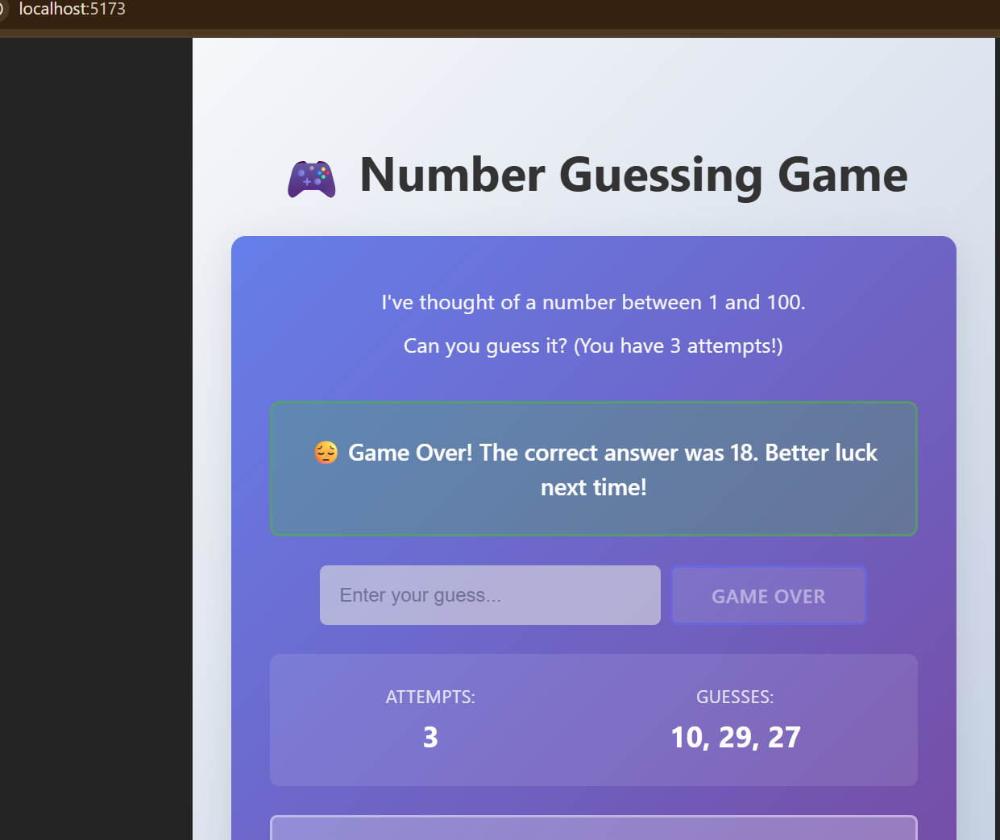

🎯 Number Guessing Game
📌 Project Description

The Number Guessing Game is an interactive program where the system generates a random number and the player tries to guess it.

After each guess, the system provides feedback:

Too High 📈

Too Low 📉

The game continues until the correct number is guessed, while tracking the total number of attempts made by the user.

This project demonstrates understanding of random number generation, loops, and conditional logic.

🚀 Features

✅ Random number generation
✅ Continuous game loop until correct guess
✅ Hint system (Too High / Too Low)
✅ Attempt counter
✅ Input handling & validation

🧠 Skills Practiced

Random number generation

Loops

Conditionals

User input handling

Basic game logic

🛠 Tech Used

React (for UI)

JavaScript / TypeScript

CSS / Tailwind (if used)

How to Run

Clone the repository:

git clone https://github.com/perfect14/ORPHION_SD_02.git

Navigate into the project folder:

cd ORPHION_SD_02

Install dependencies:

npm install

Start the development server:

npm run dev

🎮 How to Play

Enter your guess into the input field.

Click Submit Guess.

Read the hint provided by the system.

Continue until you guess the correct number.

Try to win in the least number of attempts 😉

📷 Screenshots

### Game Start

### Game Over

